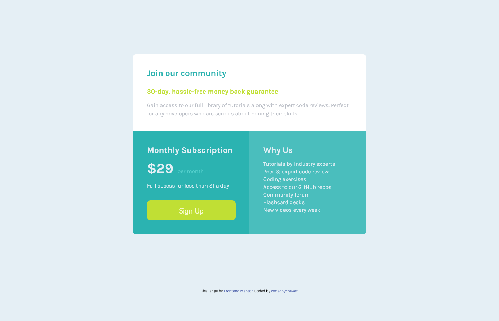
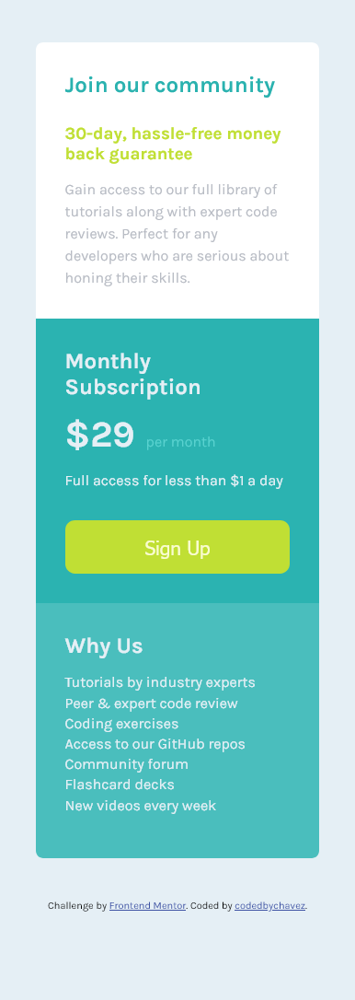

# Frontend Mentor - Single price grid component solution

This is a solution to the [Single price grid component challenge on Frontend Mentor](https://www.frontendmentor.io/challenges/single-price-grid-component-5ce41129d0ff452fec5abbbc). Frontend Mentor challenges help you improve your coding skills by building realistic projects. 

## Table of contents

- [Overview](#overview)
  - [The challenge](#the-challenge)
  - [Screenshot](#screenshot)
  - [Links](#links)
- [My process](#my-process)
  - [Built with](#built-with)
  - [What I learned](#what-i-learned)
  - [Continued development](#continued-development)
  - [Useful resources](#useful-resources)
- [Author](#author)
- [Acknowledgments](#acknowledgments)

## Overview

### The challenge

Users should be able to:

- View the optimal layout for the component depending on their device's screen size
- See a hover state on desktop for the Sign Up call-to-action

### Screenshots

#### Desktop



#### Mobile


### Links

- Solution URL: [Add solution URL here](https://your-solution-url.com)
- Live Site URL: [Add live site URL here](https://your-live-site-url.com)

## My process

### Built with

- Semantic HTML5 markup
- CSS custom properties
- Flexbox
- Mobile-first workflow

### What I learned

I learnt more about flexbox, this is something I am aiming to improve by working on these challenges.

The easiest way to center an element is to make its parent a flex container, and add the following css properties to it:

```html
<div class="flex-container">
  <div class="flex-child"> </div>
</div>
```
```css
.flex-container {
  display: flex;
  justify-content: center;
  align-items: center;
}
```

### Continued development

I plan to tackle more challenges that can be solved using flexbox.

### Useful resources

- [Conquering Responsive Layouts](https://courses.kevinpowell.co/view/courses/conquering-responsive-layouts) - I found this really helpful and I recommend anyone who is looking to learn and understand flexbox.

## Author

- Website - [Chavez Harris](https://www.codedbychavez.com)
- Frontend Mentor - [@codedbychavez](https://www.frontendmentor.io/profile/codedbychavez)

## Acknowledgments

Hats off to [frontendmentor.io](https://frontendmentor.io) for making this challenge possible and a big thank you to [Kevin Powell](https://www.youtube.com/kevinpowell) for making helpful CSS content.
